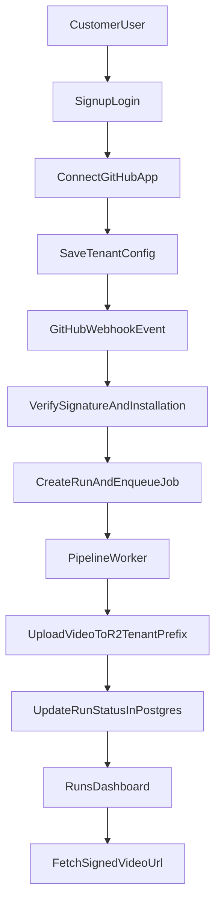

# MVP to Production SaaS Roadmap

## Scope and assumptions
- Trigger model: GitHub-driven only (webhooks/PR events).
- Tenancy: multi-tenant isolation per customer.
- GitHub access model: GitHub App installation per customer (recommended).
- Current state: local FastAPI pipeline works, no user-facing web app, no SaaS auth/multi-tenant backend.

## Target architecture

Core services:
- Web API (FastAPI): auth/session, tenant config, webhook receive, run status APIs.
- Worker service: executes `analyze_pr -> run_pipeline` jobs from queue.
- Data layer:
  - Postgres for tenants/installations/config/runs/audit metadata.
  - Redis (or managed queue) for background jobs and throttling.
  - R2 private bucket for videos + signed URL access.

## User flows to build

1) Signup and login
- Add SaaS auth for end users (OAuth provider or managed auth service).
- Create/attach user to a tenant workspace.

2) Connect GitHub App
- Customer installs your GitHub App on selected repos.
- Save installation mapping: `installation_id -> tenant_id`.

3) Configure demo behavior
- Add settings UI + API for tenant config:
  - `preview_url_template`
  - `trigger.mode`, `trigger.threshold`, include/exclude
  - `routeMap`, `appHints`, capture viewport settings

4) Webhook-triggered runs
- Receive GitHub webhook.
- Verify signature.
- Resolve tenant via installation id.
- Create `PipelineRun` row and enqueue background job.

5) Track and view runs
- Dashboard lists run history and status (`accepted/running/succeeded/failed`).
- Video playback via short-lived signed URL.

## Code changes required (mapped to current code)

## 1) Replace shared local output with per-run artifacts
Current:
- `app/webhook.py` serves one shared `app/screenshots/out.mp4` via `/out.mp4`.
- `app/render.py` always writes to fixed `SCREENSHOT_DIR/out.mp4`.

Changes:
- Introduce `run_id` for every execution.
- Use run-scoped directories (`/tmp/runs/{run_id}/...` or mounted persistent path).
- Refactor render to accept `screenshot_dir`/`output_path` args.
- Remove public `/out.mp4`; replace with run-scoped APIs.

Files:
- `app/webhook.py`
- `app/steps/pipeline.py`
- `app/render.py`

## 2) Replace in-process thread with queue worker
Current:
- `Thread(target=background_job).start()` in `app/webhook.py`.

Changes:
- Webhook handler only validates + persists + enqueues.
- Worker process executes the pipeline and updates run status.
- Return `202 Accepted` with `run_id`.

Files:
- `app/webhook.py`
- new: `app/tasks.py` or `app/worker.py`

## 3) Make config tenant-aware (remove single filesystem config dependency)
Current:
- `app/config.py` loads one `project_config.json` from repo root.
- Used by webhook/preview resolver/step generation/capture settings.

Changes:
- Store tenant config in Postgres (JSONB).
- Replace `load_config()` calls with `load_tenant_config(tenant_id)`.
- Pass tenant config through pipeline calls explicitly.

Files:
- `app/config.py`
- `app/config_types.py`
- `app/preview_url_resolver.py`
- `app/steps/step_generation.py`
- `app/webhook.py`

## 4) Switch from global token to GitHub App installation tokens
Current:
- `app/steps/pr_extraction.py` reads `GITHUB_TOKEN`.
- `app/github_comment.py` reads `GITHUB_TOKEN`.

Changes:
- Generate installation access token per event/tenant.
- Pass token into PR diff fetch + PR comment helpers.
- Persist installation metadata in DB.

Files:
- `app/steps/pr_extraction.py`
- `app/github_comment.py`
- `app/webhook.py`
- new: `app/integrations/github_app.py`

## 5) Replace local JSON spend/dedupe state with DB state
Current:
- `app/llm_guards.py` uses local files under `app/data/`.

Changes:
- Move dedupe keys and budget/accounting to DB tables.
- Make checks tenant-scoped.
- Keep cache optional and stateless-safe.

Files:
- `app/llm_guards.py`

## 6) Secure storage and delivery
Current:
- `app/storage.py` builds public URL from `R2_PUBLIC_BASE_URL`.

Changes:
- Private bucket + tenant-prefixed object keys.
- Signed URL generation for playback.
- Optional retention policies per tenant plan.

Files:
- `app/storage.py`
- new: signed URL API in `app/webhook.py` or dedicated routes module

## 7) Security hardening
- Remove unsafe secret defaults (no fallback `"secret"` in webhook verification).
- Add authenticated API boundary for all non-webhook endpoints.
- Enforce tenant authorization on runs/config/video access.
- Add rate limiting and webhook payload size guards.
- Move secrets to cloud secret manager.

Immediate fixes in current code:
- `app/webhook.py`: `GITHUB_WEBHOOK_SECRET` must be required.
- Remove or protect `/budget-status` and `/out.mp4`.

## Frontend required for SaaS
- Build a web app (for example Next.js) with:
  - Auth pages (login/logout/session).
  - Onboarding: GitHub App connect + repo selection.
  - Settings page: tenant config form.
  - Runs page: list/filter runs + status + error details.
  - Run detail page: logs summary + video player from signed URL.

Minimal API surface:
- `POST /api/webhooks/github`
- `GET /api/runs`
- `GET /api/runs/{run_id}`
- `GET /api/runs/{run_id}/video-url`
- `GET/PUT /api/tenant/config`
- `GET /api/me`

## Data model (minimum)
- `users` (id, email, auth_provider_id, created_at)
- `tenants` (id, name, plan, created_at)
- `tenant_memberships` (user_id, tenant_id, role)
- `github_installations` (installation_id, tenant_id, account_login, repos_json)
- `tenant_configs` (tenant_id, config_json, updated_at)
- `pipeline_runs` (id, tenant_id, repo_full_name, pr_number, commit_sha, status, error, started_at, finished_at, video_key, metadata_json)
- `run_events` (run_id, level, message, timestamp)
- `budget_usage` (tenant_id, month_key, amount, currency, source)

## Deployment plan

Phase 1: Production backend foundation
- Add Postgres schema and migration tooling.
- Introduce queue + worker.
- Refactor pipeline to per-run artifact paths.
- Add run status APIs.

Phase 2: GitHub App + tenant onboarding
- Implement GitHub App auth and installation flow.
- Map installations to tenants.
- Move config from file to DB.

Phase 3: Frontend MVP
- Build auth + onboarding + settings + runs pages.
- Hook up polling for run status and signed video URLs.

Phase 4: Security and reliability
- AuthZ enforcement, rate limits, secret hardening.
- Retry policies, idempotency keys, dead-letter queue.
- SLO dashboards, alerts, structured logs/traces.

Phase 5: Commercial SaaS readiness
- Quotas/plan enforcement.
- Billing integration.
- Tenant-level retention and export controls.

## Practical first 10 implementation tasks
1. Add `pipeline_runs` table and run status enum.
2. Add queue + worker scaffold.
3. Refactor `render_video()` to parameterized output paths.
4. Refactor `run_pipeline()` to use run-scoped artifact dir.
5. Change webhook endpoint to enqueue jobs and return `run_id`.
6. Implement `GET /api/runs` and `GET /api/runs/{run_id}`.
7. Add GitHub App token helper and update diff/comment calls.
8. Add tenant config storage and replace `load_config()` for runtime.
9. Change R2 upload key format to include tenant and run ids.
10. Add signed URL endpoint and remove public direct video serving.

## Definition of done for "web-ready SaaS v1"
- Users can sign up/log in and belong to a tenant.
- Tenant can connect GitHub App and configure preview/template settings.
- Webhook events create trackable runs in DB.
- Worker completes runs asynchronously and uploads tenant-scoped videos.
- Frontend shows run history and plays videos through signed URLs.
- No local-file-only or single-process state required for correctness.
- Security baseline in place (authz, secret handling, rate limiting, auditability).
